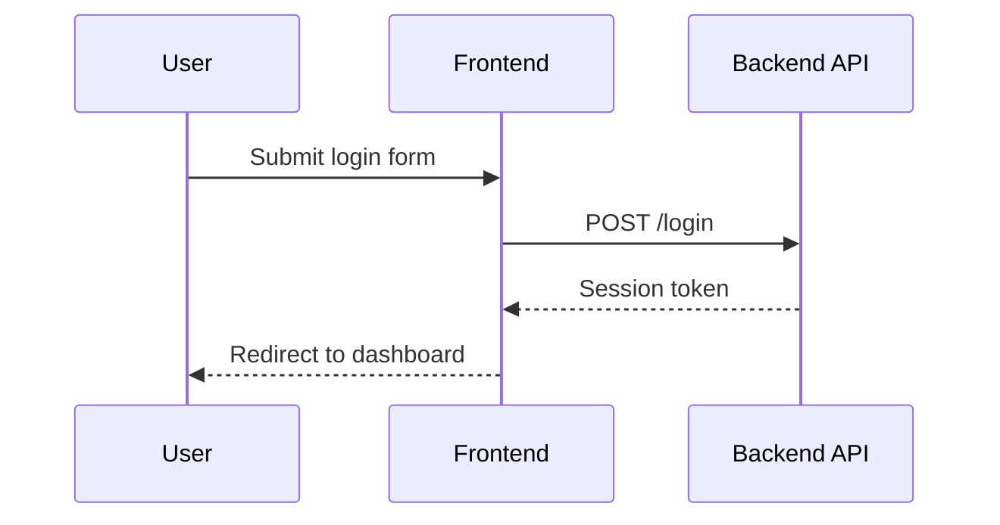

# 設計文件：SDD Skill

## Skill 名稱

建議目錄名稱：

```text
skills/sdd-skill/
```

Skill frontmatter 名稱：

```yaml
name: sdd-skill
```

## Skill 定位

此 Skill 用於在實作前建立結構化 spec，讓需求、設計與任務能先被固定。它不是一般文件撰寫 Skill，而是開發流程 Skill。

核心責任：

1. 建立 spec 目錄。
2. 產生 `requirements.md`、`design.md`、`tasks.md`。
3. 協助使用者確認 scope。
4. 在實作時依 `tasks.md` 推進。
5. 在驗證後回填任務狀態。

## 目錄結構

```text
skills/sdd-skill/
├── SKILL.md
├── assets/
│   └── templates/
│       ├── requirements.md
│       ├── design.md
│       ├── tasks.md
│       ├── draft-brief.md
│       ├── draft-discovery.md
│       └── draft-roadmap.md
└── scripts/
    └── create_spec.js
```

第一版加入 `assets/templates/` 與 `scripts/create_spec.js`。

理由：

- templates 可固定三份正式 spec 文件與 draft 文件骨架，降低不同 agent 產生章節不一致。
- script 可固定 timestamp、Type 與 kebab-case 命名規則，降低手動建立目錄時的錯誤。
- script 僅負責建立目錄與複製空白文件，不做完整 CLI，避免第一版過度抽象。

## 共用規則文件

`.specs` 命名規則需要讓多個 agent 共用，不能只存在於 `skills/sdd-skill/SKILL.md`。

規則來源：

```text
source/kiro-specs.md
```

README 只補簡短入口與連結，不重複完整規範。

需要同步的內容：

- 正式 spec 目錄格式。
- Draft 目錄格式。
- Type 清單。
- timestamp 使用系統時區。
- 三份正式文件名稱。
- draft 文件名稱。
- 實作前不得掃描整個 `.specs` 的原則。

設計理由：

- `source/kiro-specs.md` 屬於 agent-neutral 規範來源，Codex、Claude、Kiro 或其他 agent 都能引用。
- README 作為使用者入口，不承載完整規則，避免多處規範互相漂移。
- `sdd-skill` 可引用同一套規範，避免 skill 與專案規範分叉。

## Frontmatter 設計

```yaml
---
name: sdd-skill
description: SDD（Spec Driven Development）工作流程。用於在實作前建立 .specs 下的 requirements.md、design.md、tasks.md，規劃功能邊界、驗收條件、技術設計與實作任務，並在實作過程中依 tasks 追蹤進度。
---
```

description 需要包含：

- SDD 工作流程
- `.specs`
- `requirements.md`、`design.md`、`tasks.md`
- 實作前規劃
- 任務追蹤

## SKILL.md 內容結構

建議章節：

```text
# Spec Driven Development

## 使用時機
## 工作流程
## Spec 目錄命名
## 文件要求
## 實作規則
## 驗證規則
## 品質標準
```

## 工作流程設計

SDD Skill 使用輕量 SDLC：

```text
Discovery → Requirements → Design → Tasks → Implementation → Verification → Release Notes
```

此流程只定義必要產出，不接管部署、監控、事故處理或完整 release automation。

### Phase 1：理解需求

行為：

- 解析使用者要求。
- 若是既有專案變更，先閱讀相關程式碼與既有文件。
- 判斷 Type。
- 產生 kebab-case name。
- 判斷需求是否模糊或大型。
- 若需求模糊或大型，先建立 draft，不直接建立正式 spec。
- 若需求不足，先提出必要問題。

對應 SDLC：

- Discovery
- Requirements 前置釐清

### Phase 2：建立 spec 文件

行為：

- 使用 `date +"%Y-%m-%d-%H-%M"` 取得 timestamp。
- 若需求明確且範圍小，建立 `.specs/{timestamp}_{Type}-{name}/`。
- 若需求模糊或大型，建立 `.specs/drafts/{timestamp}_Draft-{name}/`。
- 產生 `requirements.md`、`design.md`、`tasks.md`。
- 若大型需求拆成多個 spec，產生 `roadmap.md` 記錄拆分理由、spec 清單、交付順序、跨 spec 相依、blocked / ready 狀態與整合驗證方式。
- 可使用 `scripts/create_spec.js` 建立目錄與初始文件。
- 初始文件由 `assets/templates/` 複製。

對應 SDLC：

- Requirements
- Design
- Tasks

## Draft 設計

Draft 目錄格式：

```text
.specs/drafts/{YYYY-MM-DD-HH-mm}_Draft-{kebab-case-name}/
```

Draft 文件：

```text
brief.md
discovery.md
roadmap.md
```

最小 draft 只需要 `brief.md`。

Draft 狀態：

```text
Status: Draft
Status: Promoted
```

Draft 規則：

- Draft 用於探索與拆分，不直接實作。
- Draft 在 `Status: Draft` 時可以修改。
- Draft promotion 後只作為歷史來源，不再修改。
- Promotion 時允許最後一次更新 draft 狀態與 `Promoted specs` 清單。
- 正式 spec 必須引用來源 draft。

Draft `brief.md` 最小格式：

```markdown
# Draft：{Name}

Status: Draft

## 背景

## 初步目標

## 非目標

## 未決問題

## 拆分判斷
```

Promotion 後格式：

```markdown
Status: Promoted

Promoted specs:
- `.specs/{YYYY-MM-DD-HH-mm}_{Type}-{kebab-case-name}/`
```

## Template 設計

templates 放在：

```text
skills/sdd-skill/assets/templates/
```

放在 `assets/` 的理由：

- 這些檔案是用來複製成輸出文件的模板，不是主要拿來讀進 context 的參考文件。
- `references/` 保留給詳細規則、長篇範例、比較資料或需要依情境載入的說明文件。
- 目前第一版的詳細規則放在 `SKILL.md` 與專案共用的 `source/kiro-specs.md`，不額外新增 `references/`。

正式 spec templates：

```text
requirements.md
design.md
tasks.md
```

draft templates：

```text
draft-brief.md
draft-discovery.md
draft-roadmap.md
```

規則：

- templates 使用繁體中文標題。
- templates 只提供空白骨架與必要提示。
- templates 不塞入與實際需求無關的假內容。
- `tasks.md` template 必須包含 `Execution Context`、`Protected Behavior`、`Allowed Changes`、`Forbidden`、`Implementation Notes`。
- `requirements.md` template 必須包含驗收情境欄位：場景、測試、假設、當、那麼。
- `design.md` template 必須包含 `受影響檔案計畫` 與 `Mermaid Diagrams`。

## Script 設計

script 放在：

```text
skills/sdd-skill/scripts/create_spec.js
```

支援模式：

```bash
node skills/sdd-skill/scripts/create_spec.js spec Feature add-hooks-installer
node skills/sdd-skill/scripts/create_spec.js draft payment-refund-flow
```

輸出目錄：

```text
.specs/{YYYY-MM-DD-HH-mm}_{Type}-{kebab-case-name}/
.specs/drafts/{YYYY-MM-DD-HH-mm}_Draft-{kebab-case-name}/
```

行為：

- 使用系統時區產生 `YYYY-MM-DD-HH-mm` timestamp。
- `spec` 模式只允許 `Feature`、`BugFix`、`Refactor`、`Docs`、`Chore`。
- name 自動轉 kebab-case。
- 建立正式 spec 時，從 templates 複製 `requirements.md`、`design.md`、`tasks.md`。
- 建立 draft 時，從 templates 複製 `draft-brief.md`、`draft-discovery.md`、`draft-roadmap.md`，輸出為 `brief.md`、`discovery.md`、`roadmap.md`。
- 不覆蓋既有目錄。
- 僅使用 Node.js 標準函式庫。
- 錯誤訊息使用繁體中文。
- script 不撰寫需求內容，不修改既有 spec，不更新 README 或 `source/kiro-specs.md`。

### Phase 3：等待確認或進入實作

行為：

- 產出文件後，回覆簡短摘要。
- 若使用者只要求文件，停在文件產出。
- 若使用者要求繼續實作，依 `tasks.md` 推進。

對應 SDLC：

- Requirements / Design / Tasks approval gate

### Phase 4：實作與驗證

行為：

- 實作前只讀取目前目標 spec 的必要文件，不掃描整個 `.specs`。
- 優先讀取 `tasks.md` 的 `Execution Context`、當前 task、Protected Behavior。
- 依需要讀取 `requirements.md`、`design.md`、`roadmap.md` 的相關段落。
- 依任務順序修改檔案。
- 不得修改 task `Boundary` 以外的檔案。
- 完成任務後更新 `tasks.md`。
- 執行專案既有測試或 dry-run。
- 驗證需包含新行為驗證與必要回歸驗證。
- 檢查 `git diff --stat` 與 `git diff --check`。
- 驗證失敗時記錄原因與修正方式。

對應 SDLC：

- Implementation
- Verification

### Phase 5：完成摘要

行為：

- 整個 spec 完成後，輸出 Release Notes 風格摘要。
- 摘要包含變更內容、驗證結果、剩餘風險。
- 若需要正式發版，交由 `release-workflow` 或相關 DevOps/SRE Skill 處理。

對應 SDLC：

- Release Notes

## 文件品質標準

### requirements.md

要求：

- 明確說明背景與問題。
- 目標與非目標分開。
- 包含驗收情境。
- 驗收條件可測。
- 變更既有行為時，記錄現有行為、新行為與影響範圍。
- 可選用 EARS 格式，但不強制。
- 不把技術實作細節塞進需求。

### design.md

要求：

- 描述受影響檔案。
- 加入受影響檔案計畫，說明每個檔案預期修改目的。
- 說明主要流程與資料流。
- 前後端同屬一個功能時，在同一份文件內分節描述。
- 跨模組互動複雜時，加入 Mermaid 圖輔助說明。
- 記錄替代方案或風險。
- 不寫成任務清單。

## Mermaid Diagrams 規則

Mermaid diagrams 為可選項。只有在文字難以清楚表達結構、流程或互動關係時才加入。

可用於：

- Architecture diagrams
- Flow charts
- Sequence diagrams
- State diagrams
- Class diagrams

適合加入 Mermaid diagrams 的情境：

- Architecture diagrams。
- Flow charts。
- Sequence diagrams。
- 前後端 API 流程。
- 多服務互動。
- async job、queue、webhook。
- 狀態轉換。
- 權限或錯誤流程。
- 部署、安裝、hook 觸發流程。

不需要加入 Mermaid diagrams 的情境：

- 單檔小修。
- 純文件修改。
- 簡單 CLI 參數修正。
- 沒有跨模組互動。

支援圖型：

```text
flowchart
sequenceDiagram
stateDiagram-v2
classDiagram
```

圖放在 `design.md`，只描述關鍵 architecture、flow 或 sequence，不取代文字設計。

範例：



## 前後端規劃原則

同一個使用者可感知功能預設使用同一個 spec，不因 frontend、backend、database 等技術層自動拆分。

在同一個 spec 內可分成：

- Frontend 設計
- Backend 設計
- API 契約
- Data Model
- Integration 驗證

只有在交付時間、團隊、API/UI 範圍明確分離時，才拆成獨立 spec。

### tasks.md

要求：

- 使用 checkbox。
- 包含 `Status: Planned | InProgress | Complete | Blocked`。
- 開頭包含 `## Execution Context`。
- 每個任務能被執行。
- 每個實作任務必須標註 `Boundary:` 與 `Verify:`。
- 每個任務可依需要標註 `Depends:` 與 `Context:`。
- 每個驗證任務有明確指令或判斷標準。
- 驗證任務需包含品質檢查清單。
- 保留 `## Implementation Notes` 區段，用於記錄實作過程中會影響後續任務的發現。
- 完成後回填 `[x]`。

任務格式範例：

```markdown
Status: Planned

## Execution Context

- 意圖:
- 非目標:
- 已定決策:
- 邊界:
- 關鍵檔案:
- 完成條件:

### Protected Behavior

- Kiro hooks 必須繼續安裝到 `.kiro/hooks/...`
- Claude hooks 不可依賴 `.kiro/hooks/...`

### 邊界

#### Allowed Changes

- `cli/install.js`
- `hooks/update-readme/**`

#### Forbidden

- 不得修改既有 Kiro hook 安裝路徑
- 不得修改 unrelated skills

## 實作任務

- [ ] 更新 CLI hooks 安裝邏輯
  - Boundary: 參考 Execution Context 的 Allowed Changes / Forbidden
  - Depends: 無
  - Context: Claude-only 安裝不可依賴 `.kiro/hooks`
  - Verify: `node cli/install.js --claude --hooks --dry-run`

## 驗證任務

- [ ] 品質檢查清單
  - 格式檢查通過
  - 測試或 dry-run 通過
  - 文件一致性已確認
  - 主要驗收情境已覆蓋
  - Protected Behavior 回歸驗證通過
  - 風險項目已處理

## Implementation Notes
```

## 實作上下文讀取策略

為控制 token 使用量，不得預設讀取整個 `.specs` 目錄。

實作前必讀：

```text
.specs/{current}/tasks.md
```

依需要讀取：

```text
.specs/{current}/requirements.md
.specs/{current}/design.md
.specs/{current}/roadmap.md
```

大型文件先用標題與關鍵字定位：

```bash
rg -n "^#|^##|^###|Boundary:|Depends:|Implementation Notes|Status:" .specs/{current}
```

只讀當前 task 相關段落。

## 防止破壞既有邏輯

使用以下護欄降低回歸風險：

- `Boundary` 限制允許修改的檔案或模組。
- `Boundary` 應拆成 `Allowed Changes` 與 `Forbidden`。
- `Protected Behavior` 記錄不可破壞的既有行為。
- `Verify` 同時包含新行為驗證與必要回歸驗證。
- 已完成 task 的相關邏輯不得重寫，除非先記錄原因。
- 修改已完成邏輯時，需在 `Implementation Notes` 記錄原因並重跑回歸驗證。
- 每個 task 完成後檢查 `git diff --stat` 與 `git diff --check`。

若 diff 超出 Boundary：

```text
狀態：Blocked
根本原因：本 task 需要修改 Boundary 外檔案
建議修復方式：更新 tasks.md 的 Boundary 或拆出新 task
```

## 測試 Selector 與完成條件

驗收情境應盡量綁定測試 selector。

格式：

```text
測試: test_name
```

若測試尚未存在：

```text
測試: 待建立
```

完成條件應引用驗收情境或 task 的 `Verify`，不要只寫抽象描述。

若測試名稱、package、filter 或執行方式變更，需同步更新 spec。

## 大型需求拆分規則

當需求範圍橫跨多個可獨立交付的功能、團隊、系統或里程碑時，可以拆成多個 spec。

拆分時需建立 `roadmap.md`，內容包含：

- 拆分理由
- spec 清單
- 交付順序
- 跨 spec 相依
- blocked / ready 狀態
- 整合驗證方式

拆分原則：

- 能單獨驗收的交付單位才拆。
- 不因 frontend/backend 技術層自動拆。
- 若拆分後需要共享 API 契約，需在 roadmap 或相關 design 中明確記錄。

## 摘要回覆規則

每次建立或更新 spec 文件後，回覆需包含：

- 關鍵決策：列出本次固定下來的 1 到 3 個決策。
- 待確認項目：列出仍需使用者確認的問題，若沒有則寫無。
- 風險：列出主要風險與處理方向。
- 下一步：說明接下來是等待確認、實作，或補文件。

摘要應簡短，不貼完整文件內容。

## 樣本參考設計

Skill 需在 `SKILL.md` 中提供三份文件的最小樣本結構：

- `requirements.md` 樣本
- `design.md` 樣本
- `tasks.md` 樣本

樣本用途：

- 讓 agent 建立 spec 時有穩定骨架。
- 降低不同 spec 章節命名不一致。
- 讓 `requirements.md` 的驗收情境固定包含場景、測試、假設、當、那麼。
- 讓 `tasks.md` 固定包含中文化 Execution Context、Protected Behavior、Boundary、Verify 與品質檢查清單。

樣本限制：

- 只放必要章節。
- 不加入過多假資料。
- Mermaid diagrams 範例只放一個簡短 `flowchart`。
- 若實際需求不需要 Mermaid diagrams，允許寫「不需要」。

## 風險與處理

### 風險：小改動也被迫產生過多文件

處理方式：

- Skill 只在使用者要求或變更風險較高時使用。
- 單行修正、簡單文字調整不強制建立 spec。

### 風險：文件產出後沒有跟實作同步

處理方式：

- 實作完成後必須更新 `tasks.md`。
- 若實作偏離設計，需同步修正 `design.md`。

### 風險：Type 命名不一致

處理方式：

- Type 僅允許 `Feature`、`BugFix`、`Refactor`、`Docs`、`Chore`。
- 不新增其他 Type，除非先修改 Skill 規範。

### 風險：誤以為 SDD 可完全保證正確性

處理方式：

- 明確說明 SDD 不保證需求本身正確。
- 明確說明 SDD 不取代人工產品判斷與架構審查。
- 明確說明 non-functional requirements 不一定能完全機械驗證。
- 測試 selector 變更後，需同步更新 spec。
