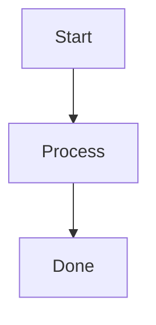

# 需求文件：SDD Skill

## 背景

目前專案已開始使用 `.specs/` 目錄記錄功能規劃，包含 `requirements.md`、`design.md`、`tasks.md`。為了讓後續功能開發在實作前先固定需求、設計與可驗證任務，需要新增一個 SDD Skill，讓 Codex 在使用者要求「先規劃」、「寫 spec」、「需求設計 task」、「SDD」時，能用一致流程產出規格文件。

## 目標

1. 新增一個 `sdd-skill` Skill。
2. 定義 `.specs` 目錄命名規則。
3. 定義 `requirements.md`、`design.md`、`tasks.md` 三份文件的責任邊界。
4. 定義從規劃到實作再到驗證的工作流程。
5. 定義任務勾選規則，確保實作進度能回填到 `tasks.md`。
6. 定義文件產出後的摘要回覆規則。
7. 定義輕量 Feature 狀態與跨 spec 依賴管理規則。
8. 定義輕量 SDLC 階段與每階段必要產出。
9. 提供 `assets/templates/` 文件範本，讓不同 agent 產生一致的 spec 骨架。
10. 提供 script 自動建立 spec 或 draft 目錄與初始文件。
11. 將 `.specs` 命名規則同步到 agent-neutral 文件，讓多個 agent 可共用。

## 非目標

1. 不建立完整 CLI 工具。
2. 不改動現有 hooks installer。
3. 不強制所有小修改都必須建立 spec。
4. 不實作跨 agent 安裝流程或外部工具鏈整合。

## 使用時機

當使用者提出以下需求時，應使用此 Skill：

- 要求「先規劃」、「先寫文件」、「先產文件」。
- 要求「需求、設計、task」。
- 提到 SDD 或 Spec Driven Development。
- 功能影響多個檔案、CLI 行為、安裝流程、公開文件或發布流程。
- 修改前需要先釐清範圍、驗收條件與實作順序。

## 輕量 SDLC

SDD Skill 採用輕量 SDLC：

```text
Discovery → Requirements → Design → Tasks → Implementation → Verification → Release Notes
```

每個階段只要求必要產出，不引入額外工具鏈。

| 階段 | 使用時機 | 產出 |
|------|----------|------|
| Discovery | 需求模糊、大型功能、跨多個 spec | 問題背景、目標、非目標、拆分判斷 |
| Requirements | 確認要做什麼 | `requirements.md` |
| Design | 需求確認後 | `design.md` |
| Tasks | 設計確認後 | `tasks.md` |
| Implementation | 使用者要求開始實作 | 程式碼變更與 `Implementation Notes` |
| Verification | 每個 task 完成與整體完成時 | 測試、dry-run、回歸驗證、diff 檢查 |
| Release Notes | 整個 spec 完成後 | 變更摘要、驗證結果、剩餘風險 |

第一版不包含 Deployment、Monitoring、Incident、Postmortem、完整 release automation，避免與既有 `release-workflow`、`devops-*`、`sre-*` Skills 重疊。

## Draft 流程

需求明確且範圍小時，直接建立正式 spec。

需求模糊或大型需求時，先建立 draft：

```text
.specs/drafts/{YYYY-MM-DD-HH-mm}_Draft-{kebab-case-name}/
```

Draft 可包含：

```text
brief.md
discovery.md
roadmap.md
```

最小 draft 只需要 `brief.md`。

Draft 用途：

- 探索問題與背景
- 收斂目標與非目標
- 比較方案
- 釐清未知問題
- 拆分正式 specs

Draft 不直接實作。

Draft 在 `Status: Draft` 時可以修改；一旦拆出正式 spec 並標記為 `Status: Promoted`，draft 視為歷史來源，不再修改。

Promotion 時允許對 draft 做最後一次更新：

```markdown
Status: Promoted

Promoted specs:
- `.specs/{YYYY-MM-DD-HH-mm}_{Type}-{kebab-case-name}/`
```

正式 spec 必須引用來源 draft：

```markdown
## 來源

- Draft: `.specs/drafts/{YYYY-MM-DD-HH-mm}_Draft-{kebab-case-name}/brief.md`
```

Promotion 後若需求方向大幅改變，不回頭修改已 promoted draft，應建立新的 draft 或調整正式 spec。

## 命名規則

Spec 目錄格式：

```text
.specs/{YYYY-MM-DD-HH-mm}_{Type}-{kebab-case-name}/
```

規則：

- timestamp 使用執行環境的系統時區。
- timestamp 格式固定為 `YYYY-MM-DD-HH-mm`。
- timestamp 與 `Type` 之間使用 `_`。
- `Type` 與 `name` 之間使用 `-`。
- `Type` 僅允許 `Feature`、`BugFix`、`Refactor`、`Docs`、`Chore`。
- `name` 使用 kebab-case。
- 不使用空白與中文資料夾名稱。

取得 timestamp：

```bash
date +"%Y-%m-%d-%H-%M"
```

此命名規則需同步到 agent-neutral 文件，讓不同 agent 不必依賴 `sdd-skill` 才能遵循同一套 `.specs` 結構。規則來源以 `source/kiro-specs.md` 為主，README 只保留簡短入口與連結。

## Type 定義

| Type | 用途 |
|------|------|
| `Feature` | 新增功能或能力 |
| `BugFix` | 修正錯誤、壞掉的行為、解析問題 |
| `Refactor` | 不改變外部行為的內部重構 |
| `Docs` | 文件、規格、README、說明內容 |
| `Chore` | 維護性工作，例如版本、打包、設定、工具調整 |

若一件事同時包含多種 Type，選擇主要目的。

## 前後端拆分原則

同一個使用者可感知功能預設放在同一個 spec，不因 frontend、backend、database 等技術層自動拆分。

同一個 spec 可在文件內分章節描述：

- Frontend 需求與任務
- Backend 需求與任務
- API 契約
- Data Model
- Integration 驗證

只有符合以下條件時才拆成不同 spec：

- 前後端會分不同時間交付。
- 前後端由不同團隊獨立執行。
- API 已穩定，這次只做 UI。
- UI 已存在，這次只補 backend。
- 其中一邊是獨立 bugfix，不影響另一邊。

## 產出文件

每個 spec 目錄至少包含：

```text
requirements.md
design.md
tasks.md
```

Skill 應提供 `assets/templates/` 作為文件範本來源，至少包含：

```text
requirements.md
design.md
tasks.md
draft-brief.md
draft-discovery.md
draft-roadmap.md
```

Skill 應提供 `scripts/create_spec.js` 自動建立正式 spec 或 draft：

```bash
node skills/sdd-skill/scripts/create_spec.js spec Feature add-hooks-installer
node skills/sdd-skill/scripts/create_spec.js draft payment-refund-flow
```

script 僅負責建立目錄與複製空白文件，不負責撰寫內容、不修改既有 spec、不接管完整 CLI。

### requirements.md

必須包含：

- 背景
- 目標
- 非目標
- 使用者故事或使用情境
- 驗收情境
- 驗收條件
- 驗證需求

每個驗收情境可使用以下欄位：

```text
場景:
測試:
假設:
當:
那麼:
```

若測試尚未存在，`測試` 欄位填寫 `待建立`。

若需求屬於變更既有行為，應補充：

- 現有行為
- 新行為
- 影響範圍

可選用 EARS 格式描述需求與情境，但不強制。若使用 EARS，需保持需求可驗收且情境具體。

### design.md

必須包含：

- 設計原則
- 目標結構或流程
- 受影響檔案
- 受影響檔案計畫
- 關鍵行為
- 必要時加入 Mermaid 圖
- 風險與處理方式

Mermaid diagrams 只在文字難以清楚表達結構、流程或互動關係時加入，放在 `design.md`。可用於：

- Architecture diagrams
- Flow charts
- Sequence diagrams
- State diagrams
- Class diagrams

常見圖型包含：

- `flowchart`：architecture diagrams、flow charts、決策流程、安裝流程
- `sequenceDiagram`：sequence diagrams、前後端、API、服務互動
- `stateDiagram-v2`：state diagrams、狀態機、生命週期
- `classDiagram`：class diagrams、資料模型或核心結構

### tasks.md

必須包含：

- Status
- Execution Context
- Protected Behavior
- 意圖
- 非目標
- 已定決策
- 邊界
- 關鍵檔案
- 完成條件
- 可勾選任務清單
- 實作任務
- 驗證任務
- Boundary / Depends / Context / Verify
- 品質檢查清單
- Implementation Notes
- 後續改善

`Status` 僅允許：

```text
Planned
InProgress
Complete
Blocked
```

任務必須具體到可執行、可驗證。

每個實作 task 必須包含 `Boundary` 與 `Verify`，並可依需要補充 `Depends` 與 `Context`：

```text
Boundary:
Depends:
Context:
Verify:
```

大型需求可拆成多個 spec，並建立 `roadmap.md` 說明拆分理由、spec 清單、交付順序、跨 spec 相依、blocked / ready 狀態與整合驗證方式。

## Brownfield 支援

既有專案變更前，必須先閱讀相關程式碼與既有文件，再撰寫 `design.md`。不可只根據需求文字想像設計。

變更既有行為時，`requirements.md` 必須記錄：

- 現有行為
- 新行為
- 影響範圍

## 摘要回覆規則

每次建立或更新 spec 文件後，回覆需包含簡短摘要：

- 關鍵決策
- 待確認項目
- 風險
- 下一步

摘要需聚焦本次文件變更，不重複貼完整文件內容。

## 實作上下文讀取規則

實作前不得掃描整個 `.specs` 目錄作為預設行為。只讀取目前目標 spec 的必要文件。

實作前必讀：

```text
.specs/{current}/tasks.md
```

依需要讀取：

```text
.specs/{current}/requirements.md
.specs/{current}/design.md
.specs/{current}/roadmap.md
```

`requirements.md` 與 `design.md` 僅在以下情況讀取相關段落：

- 開始新 task
- 驗證失敗
- 實作偏離設計
- context 中斷後恢復

若 spec 文件很長，先使用標題與關鍵字搜尋定位，再讀當前 task 相關段落：

```bash
rg -n "^#|^##|^###|Boundary:|Depends:|Implementation Notes|Status:" .specs/{current}
```

## Execution Context

`tasks.md` 開頭應包含 `Execution Context`，作為實作時優先讀取的摘要控制面。

內容包含：

- 意圖
- 非目標
- 已定決策
- 邊界
- 關鍵檔案
- 完成條件
- Protected Behavior

## Protected Behavior

`tasks.md` 必須可包含 `Protected Behavior`，記錄不可被破壞的既有行為。

實作每個 task 前，需讀取：

- Execution Context
- 當前 task
- Protected Behavior

每個 task 的 `Verify` 必須包含新行為驗證與必要回歸驗證，避免修正當前問題時破壞已完成邏輯。

## Boundary 護欄

每個 task 必須可標註：

```text
Boundary:
Depends:
Context:
Verify:
```

`Boundary` 應拆成：

```text
Allowed Changes:
Forbidden:
```

`Allowed Changes` 用於列出允許修改的檔案、目錄或模組。

`Forbidden` 用於列出禁止修改的檔案、目錄、模組或不可破壞的行為。

規則：

- 不得修改 `Boundary` 以外的檔案。
- 若必須修改 `Boundary` 以外的檔案，需先更新 `tasks.md` 或詢問使用者。
- 不得重寫已完成 task 的實作，除非有明確原因。
- 若修改已完成 task 相關邏輯，必須記錄原因到 `Implementation Notes`，並重跑相關回歸驗證。

每完成一個 task，必須檢查：

```bash
git diff --stat
git diff --check
```

若 diff 超出 Boundary，需標記為 `Blocked` 或更新任務邊界後再繼續。

## 測試 Selector 與完成條件

驗收情境應盡量綁定測試 selector：

```text
測試: test_name
```

若測試尚未存在，填寫：

```text
測試: 待建立
```

完成條件應優先引用驗收情境或 task 的 `Verify`，避免只寫抽象描述。

若測試名稱、package、filter 或執行方式變更，需同步更新 spec。

## 品質檢查清單

不額外建立 `checklist.md`。品質檢查清單放在 `tasks.md` 的驗證任務中。

驗證任務應覆蓋：

- 格式檢查
- 測試或 dry-run
- 文件一致性
- 主要驗收情境
- Protected Behavior 回歸驗證
- 風險項目是否已處理

## 限制

SDD Skill 不保證以下事項：

- 不保證需求本身正確。
- 不取代人工產品判斷。
- 不取代人工架構審查。
- 不保證所有 non-functional requirements 都可機械驗證。
- 不保證驗收情境完整覆蓋所有風險。
- 測試 selector 變更後，無法自動保證 spec 已同步更新。

## 樣本參考定義

Skill 需提供 `requirements.md`、`design.md`、`tasks.md` 的最小樣本結構，作為建立 spec 時的參考。

樣本需符合以下原則：

- 可直接複製後填寫。
- 保留必要章節。
- 使用繁體中文標題。
- 技術必要詞可保留英文。
- 不塞入與當前需求無關的範例內容。

### requirements.md 樣本

````markdown
# 需求文件：{Feature Name}

## 背景

{說明問題、機會或變更來源}

## 目標

1. {目標一}
2. {目標二}

## 非目標

1. {不處理範圍一}
2. {不處理範圍二}

## 現有行為

{變更既有行為時填寫；新功能可省略}

## 新行為

{變更後使用者或系統可觀察到的行為}

## 影響範圍

- {受影響模組、流程、使用者或 API}

## 使用情境

- 作為 {角色}，我想要 {能力}，以便 {價值}。

## 驗收情境

### 情境：{情境名稱}

- 場景：{場景名稱}
- 測試：`{test_name}` 或 `待建立`
- 假設：{前置條件}
- 當：{操作或事件}
- 那麼：{可驗收結果}

## 驗收條件

1. {可測條件}
2. {可測條件}

## 驗證需求

- {測試、dry-run、人工驗證或文件檢查}
````

### design.md 樣本

````markdown
# 設計文件：{Feature Name}

## 設計原則

- {設計原則}

## 受影響檔案計畫

| 檔案 | 預期變更 | 原因 |
|------|----------|------|
| `{path}` | {變更摘要} | {原因} |

## 目標結構或流程

{描述主要結構、流程或資料流}

## Mermaid Diagrams

{需要時加入 architecture diagrams、flow charts 或 sequence diagrams；不需要時寫「不需要」}



## 關鍵行為

- {重要行為}

## 前後端或跨模組設計

{同一功能涉及多層時填寫；不涉及可省略}

## 風險與處理方式

| 風險 | 影響 | 處理方式 |
|------|------|----------|
| {風險} | {影響} | {處理} |
````

### tasks.md 樣本

````markdown
# 任務文件：{Feature Name}

Status: Planned

## Execution Context

- 意圖: {本 spec 要達成什麼}
- 非目標: {不做什麼}
- 已定決策: {已決定且不反覆討論的事項}
- 邊界: {允許與不允許修改的範圍}
- 關鍵檔案: {關鍵檔案}
- 完成條件: {主要驗收檢查}

### Protected Behavior

- {不可破壞的既有行為}

### 邊界

#### Allowed Changes

- `{允許修改的檔案、目錄或模組}`

#### Forbidden

- {禁止修改的檔案、目錄、模組或不可破壞的行為}

## 實作任務

- [ ] {任務名稱}
  - Boundary: 參考 Execution Context 的 Allowed Changes / Forbidden
  - Depends: {相依任務，無則填無}
  - Context: {任務必要背景}
  - Verify: `{驗證指令或檢查方式}`

## 驗證任務

- [ ] 品質檢查清單
  - 格式檢查通過
  - 測試或 dry-run 通過
  - 文件一致性已確認
  - 主要驗收情境已覆蓋
  - Protected Behavior 回歸驗證通過
  - 風險項目已處理

## Implementation Notes

- {實作過程中影響後續任務的發現}

## 後續改善

- [ ] {非本次必要但值得追蹤的項目}
````

## 驗收條件

1. 新增的 Skill 能清楚說明何時觸發。
2. Skill 指示建立 `.specs/{timestamp}_{Type}-{name}/`。
3. Skill 明確要求三份文件。
4. Skill 明確要求實作後回填 `tasks.md`。
5. Skill 明確要求產出或更新 spec 後提供摘要。
6. Skill 明確要求 `tasks.md` 包含 `Status` 與品質檢查清單。
7. Skill 明確描述輕量 SDLC 階段與每階段必要產出。
8. Skill 提供 `assets/templates/` 文件範本，包含正式 spec 與 draft 範本。
9. Skill 提供 `scripts/create_spec.js`，可建立正式 spec 與 draft 目錄。
10. `.specs` 命名規則同步到 `source/kiro-specs.md`，README 保留入口摘要。
11. Skill 本身保持精簡，不超過 500 行。
