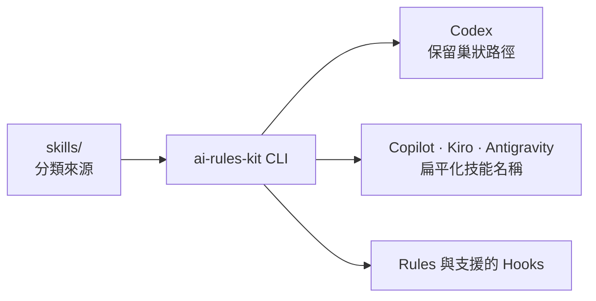

# ai-rules-kit

將一套可版本控制的 AI 開發規範、領域 skills 與支援 hooks，安裝到團隊使用的 AI IDE。

本專案把 `skills/` 視為依領域分類的來源；安裝器會依目標 IDE 的能力，產生相容的規則、skill 與 hook。來源結構不需要為任何單一工具妥協。

- [快速開始](#快速開始)
- [系統需求](#系統需求)
- [支援的 IDE](#支援的-ide)
- [語言規範](#語言規範)
- [Skills 清單](#skills-清單)
- [CLI 參考](#cli-參考)
- [貢獻](#貢獻)

## 適用情境

- 團隊希望在每個專案安裝一致的規則與專業 skills。
- 開發者希望以 `--global` 在自己的環境保留常用規則與 skills。
- 同一份 skill 來源需要同時支援保留巢狀結構與只接受單層目錄的 IDE。

它不是執行期外掛或代理框架；它的責任是把儲存在此 repository 的檔案，複製到各 IDE 可辨識的位置。

## 快速開始

在目標專案的根目錄執行：

```bash
# 僅安裝 Codex skills
npx --yes @vincent119/ai-rules-kit --codex --skills
```

Codex 會保留來源的分類路徑，例如：

```text
.codex/skills/documentation/readme/
.codex/skills/frontend/react/react-component-patterns/
```

若要安裝 Kiro 支援的全部元件，執行：

```bash
npx --yes @vincent119/ai-rules-kit --kiro
```

這會安裝 Kiro 的 rules、skills 與 hooks；其 skills 目的端會使用扁平名稱。

## 系統需求

- Node.js 14.0.0 或更新版本。
- npm 或 npx。

不需要預先全域安裝此套件，可直接透過 `npx` 執行。

## 核心能力

- 支援 GitHub Copilot、Cursor、Claude Code、Codex、Kiro 與 Antigravity。
- 提供 9 種程式語言或設定檔的規則，以及額外的 commit、PR 規範。
- 提供依領域分類的 skills，CLI 會遞迴探索所有 `SKILL.md`。
- Codex 保留來源的巢狀 skill 路徑；GitHub Copilot、Kiro 與 Antigravity 會扁平化路徑以相容其目的端。
- 支援專案層級、使用者層級、選擇性安裝與 dry run 預覽。

## 運作方式



例如 `programming/go/go-grpc` 是來源 skill 的 canonical ID。安裝到 Codex 時仍使用此層級；安裝到需要單層目的端的 IDE 時則會成為 `programming-go-go-grpc`。因此新增工具或改變工具限制時，只需調整安裝器的 adapter，不必重組來源 repository。

## 支援的 IDE

| IDE | 旗標 | Rules | Skills | Hooks |
| --- | --- | --- | --- | --- |
| GitHub Copilot（VS Code） | `--copilot`、`--vscode` | 支援 | 支援 | 不支援 |
| Cursor | `--cursor` | 支援 | 不支援 | 不支援 |
| Claude Code | `--claude` | 支援 | 不支援 | 支援 |
| Codex | `--codex` | 支援 | 支援 | 不支援 |
| Kiro | `--kiro` | 支援 | 支援 | 支援 |
| Antigravity | `--antigravity` | 支援 | 支援 | 不支援 |

未指定元件旗標時，CLI 會安裝該 IDE 支援的全部元件。指定 `--rules`、`--skills` 或 `--hooks` 後，則只安裝明確指定且該 IDE 支援的元件。

## 語言規範

| 語言 | 規範檔案 | 適用檔案類型 |
|------|---------|-------------|
| `go` | `go-core-minimal.md` / `go-core-extended.md` | `*.go`, `go.mod`, `go.sum` |
| `bash` | `bash.md` | `*.sh`, `*.bash` |
| `rust` | `rust.md` | `*.rs`, `Cargo.toml` |
| `python` | `python.md` | `*.py` |
| `typescript` | `typescript.md` | `*.ts`, `*.tsx`, `*.js`, `*.jsx` |
| `react` | `react.md` | `*.tsx`, `*.jsx` |
| `yaml` | `yaml.md` | `*.yaml`, `*.yml` |
| `helm` | `helm.md` | `Chart.yaml`, `values.yaml`, `templates/**/*.yaml` |
| `pulumi` | `pulumi.md` | `Pulumi.yaml`, `Pulumi.*.yaml` |

額外規範

| 規範 | 選項 | 用途 |
| --- | --- | --- |
| Commit | `--extras commit` | 提供 Conventional Commits 與提交前檢查原則。 |
| Pull Request | `--extras pr` | 提供 PR 描述、審查與合併前檢查原則。 |

## Skills 清單

### Documentation

| Skill ID | 說明 |
|----------|------|
| `documentation/changelog-generator` | Transform Git commits into user-facing changelogs. |
| `documentation/readme` | 建立、改善或稽核 GitHub 專案的 README。 |
| `documentation/technical-writing` | 建立、改善或稽核 README 以外的技術文件，例如架構文件、操作手冊、教學、ADR 與概念說明。 |

### Programming

| Skill ID | 說明 |
|----------|------|
| `programming/go/go-api-design` | Go API 設計與版本管理：JSON Envelope、Request/Response 模式、API Versioning、 |
| `programming/go/go-ci-tooling` | Go CI/CD 工具配置：Makefile、golangci-lint、GitHub Actions、Docker、測試覆蓋率、 |
| `programming/go/go-configuration` | Go 設定管理最佳實務：Viper 配置、環境變數優先級、Secrets 處理、設定驗證、 |
| `programming/go/go-database` | Go Database Migration 與 ORM 規範：Migration 工具選擇（golang-migrate/goose）、 |
| `programming/go/go-ddd` | Go DDD 架構設計規範：領域驅動設計 (Domain-Driven Design)、Bounded Context（限界上下文）、 |
| `programming/go/go-dependency-injection` | Go 依賴注入模式與工具：Interface 設計、Constructor Pattern、Uber Fx/Wire 使用、 |
| `programming/go/go-domain-events` | Go Domain Events 實作：事件定義、發布模式、Event Bus、Outbox Pattern、冪等處理、 |
| `programming/go/go-examples` | Go 實作範例庫：完整的 HTTP Client、Repository Pattern、Use Case、Handler、 |
| `programming/go/go-graceful-shutdown` | Go 優雅關機（Graceful Shutdown）模式：Signal 處理、HTTP Server shutdown、gRPC GracefulStop、 |
| `programming/go/go-grpc` | Go gRPC 完整實作規範：Proto 檔案管理、Buf 使用、Interceptor 設計、健康檢查協議、 Deadline 與 Context 處理、錯誤代碼映射、優雅關機（GracefulStop）。 |
| `programming/go/go-http-advanced` | Go HTTP 進階實作：Transport 重用與配置、重試策略與指數退避、Body 重播機制、 |
| `programming/go/go-observability` | Go 可觀測性規範：結構化日誌（zap/slog）、Prometheus Metrics 規範、OpenTelemetry 整合、 |
| `programming/go/go-testing-advanced` | Go 進階測試策略：Table-driven tests 進階模式、Mocking 策略（uber-go/mock）、 |
| `programming/rust/rust-api-design` | Rust API 設計模式。 |
| `programming/rust/rust-async-concurrency` | Rust 非同步與並行模式。 |
| `programming/rust/rust-error-handling` | Rust 錯誤處理模式。 |
| `programming/rust/rust-project-structure` | Rust 專案目錄結構。 |
| `programming/rust/rust-safety-performance` | Rust 安全性與效能最佳實踐。 |
| `programming/rust/rust-testing` | Rust 測試策略。 |

### Frontend

| Skill ID | 說明 |
|----------|------|
| `frontend/react/react-component-patterns` | React 元件設計模式。 |
| `frontend/react/react-hooks-state` | React Hooks 與狀態管理模式。 |
| `frontend/react/react-performance` | React 效能最佳化模式。 |
| `frontend/react/react-project-structure` | React 專案目錄結構。 |

### Infrastructure

| Skill ID | 說明 |
|----------|------|
| `infrastructure/aws/eks-ami` | 查詢 Amazon EKS 專用 AMI (AL2023 x86_64)。 |
| `infrastructure/devops/devops-cicd-pipeline` | CI/CD Pipeline 設計、建置、監控與最佳化完整流程。 |
| `infrastructure/devops/devops-deployment-strategies` | 部署策略目錄。 |
| `infrastructure/devops/devops-pipeline-security-gates` | CI/CD Pipeline 安全閘門設計指南。 |
| `infrastructure/devops/devops-runbooks` | Operational runbook and procedure documentation specialist. |
| `infrastructure/kubernetes/debug` | Kubernetes troubleshooting workflow - Pod status, logs, events, exec, and resource monitoring. |
| `infrastructure/sre/sre-cicd-pipeline` | CI/CD Pipeline 文件產生器。 |
| `infrastructure/sre/sre-documentation-generation` | SRE 文件產生器。 |
| `infrastructure/sre/sre-incident-postmortem` | 事故事後分析（Postmortem）完整流程。 |
| `infrastructure/sre/sre-rca-methodology` | 根因分析（RCA）方法論詳細指南。 |
| `infrastructure/sre/sre-sla-impact-calculator` | 基於 SLA/SLO 量化評估事故影響的計算模型與業務影響矩陣。 |
| `infrastructure/sre/sre-vpc-architecture` | AWS VPC 架構文件產生器。 |

### Engineering

| Skill ID | 說明 |
|----------|------|
| `engineering/agent-development/sdd-skill` | SDD（Spec Driven Development）工作流程。 |
| `engineering/agent-development/skill-creator` | Guide for creating effective skills. |
| `engineering/code-quality/dev-code-reviewer` | 自動化程式碼審查完整流程。 |
| `engineering/code-quality/dev-refactoring-catalog` | 程式碼重構目錄。 |
| `engineering/security/dev-vulnerability-patterns` | 程式碼漏洞模式資料庫。 |
| `engineering/testing/test-coverage` | Run tests with coverage reports for Go, Python, and Node. |
| `engineering/workflow/git-repo-init` | Git repo 初始化範本產生器。 |
| `engineering/workflow/release-workflow` | Standard release workflow - Test, tag, push. |

### Design

| Skill ID | 說明 |
|----------|------|
| `design/presentation/pres-data-visualization-guide` | 資料視覺化圖表選擇指南與資訊架構設計。 |
| `design/presentation/pres-presentation-designer` | 簡報設計完整製作流程。 |
| `design/presentation/pres-slide-layout-patterns` | 投影片版面模式庫。 |
| `design/ui/ui-component-guidelines` | UI 元件設計規範。 |
| `design/ui/ui-design-principles` | UI 設計原則。 |
| `design/ui/ui-design-tokens` | Design Token 管理。 |

### Business

| Skill ID | 說明 |
|----------|------|
| `business/financial-health-risk` | 財務健康風險分析完整流程。 |

### Productivity

| Skill ID | 說明 |
|----------|------|
| `productivity/meeting-transcriber` | 會議錄音轉會議紀要。 |

## CLI 參考

基本格式：

```bash
npx @vincent119/ai-rules-kit --<ide> [選項]
```

| 選項 | 說明 |
| --- | --- |
| `--copilot`、`--vscode`、`--cursor`、`--claude`、`--codex`、`--kiro`、`--antigravity` | 選擇目標 IDE。 |
| `--rules` | 只安裝 rules。 |
| `--skills [ids]` | 安裝全部 skills；提供以逗號分隔的 canonical ID 時，僅安裝指定 skills。 |
| `--hooks` | 只安裝目標 IDE 支援的 hooks。 |
| `--all` | 安裝目標 IDE 支援的全部元件。 |
| `--global` | 安裝到使用者層級；global 安裝不包含 hooks。 |
| `--lang <名稱>` | 指定語言規範，可用逗號分隔多個名稱。 |
| `--mode <minimal\|extended>` | 選擇語言規範模式。 |
| `--extras <commit,pr>` | 加入額外規範。 |
| `--dry-run` | 列出預計建立或覆寫的檔案，不寫入磁碟。 |
| `--help`、`-h` | 顯示完整說明。 |

使用 `--skills list` 可列出目前可安裝的 skill canonical ID：

```bash
npx --yes @vincent119/ai-rules-kit --codex --skills list
```

## 常用操作

預覽 Codex skills 安裝結果：

```bash
npx --yes @vincent119/ai-rules-kit --codex --skills --dry-run
```

只安裝 README 與 React 元件模式 skills：

```bash
npx --yes @vincent119/ai-rules-kit --codex --skills "documentation/readme,frontend/react/react-component-patterns"
```

安裝到使用者層級：

```bash
npx --yes @vincent119/ai-rules-kit --codex --global --skills
```

更新既有安裝時，重新執行原本使用的目標與元件選項即可。CLI 會覆寫本次複製的同名檔案，但不會自動刪除來源已移除的舊檔案；若曾手動修改安裝結果，請先透過版本控制或備份保留變更。

## Skill ID 與目的端路徑

Skill 的 canonical ID 是 `skills/` 下、含有 `SKILL.md` 之目錄的相對路徑。例如：

```text
skills/documentation/readme/SKILL.md
→ documentation/readme
```

| 目標類型 | `documentation/readme` 的安裝結果 |
| --- | --- |
| Codex | `.codex/skills/documentation/readme/` |
| GitHub Copilot | `.github/skills/documentation-readme/` |
| Kiro | `.kiro/skills/documentation-readme/` |
| Antigravity | `.agent/skills/documentation-readme/` |

為了相容舊指令，`aws-eks-ami` 與 `k8s-debug` 仍可作為 `infrastructure/aws/eks-ami`、`infrastructure/kubernetes/debug` 的別名使用。

## 安裝範圍

| 範圍 | 用法 | 適用情境 |
| --- | --- | --- |
| 專案層級 | 預設 | 在目前工作目錄建立 IDE 對應的設定目錄，適合提交給團隊共同使用。 |
| 使用者層級 | `--global` | 安裝到使用者設定目錄，適合個人預設；不安裝 hooks。 |

## Rules 模式

`minimal` 是 GitHub Copilot、Claude Code 與 Codex 的預設模式；其餘 IDE 預設為 `extended`。目前兩種模式僅影響 Go 規範的內容範圍，其他語言規範相同。

## Hooks

目前提供 `update-readme` hook，支援 Kiro 與 Claude Code。當 skill 或來源規範變更時，它會更新本 README 的語言規範與 skills 清單，避免手動清單與實際內容漂移。

```bash
# Kiro
npx --yes @vincent119/ai-rules-kit --kiro --hooks

# Claude Code
npx --yes @vincent119/ai-rules-kit --claude --hooks
```

## 貢獻

新增或調整規範前，請維持來源目錄的領域分類：rules 放在 `source/`，skills 放在 `skills/<領域>/<skill>/SKILL.md`。README 是入口文件；較長的流程、架構或操作說明應建立為獨立技術文件，再由 README 連結。

提交前執行：

```bash
npm test
node hooks/update-readme/script/update-readme.js
git diff --check
```

第二個指令會依目前來源重新產生本文件的語言規範與 skills 清單。

## 版本與授權

套件發布於 [npm](https://www.npmjs.com/package/@vincent119/ai-rules-kit)，原始碼位於 [GitHub](https://github.com/vincent119/ai-rules-kit)。授權條款為 [MIT](LICENSE)。
