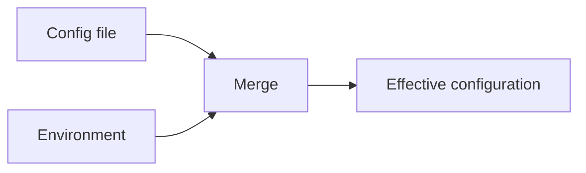

# README Anatomy

README 的順序應先協助讀者評估與開始使用，再提供深入資訊。每段都先判斷適用性；專案事實仍須通過 evidence checklist 驗證。

## 1. Project Title and Description

### Purpose

讓讀者立即知道專案是什麼、為誰解決什麼問題。

### When to Include

永遠納入。H1 使用實際名稱，後接一句說明與二至四句背景。

### How to Write It Well

- 說明使用者收益、目標讀者與問題，不只描述技術。
- 將描述置於 badges、圖片與裝飾內容之前。

### Common Mistakes

- 以口號、版本或裝飾取代清楚描述。
- 只列框架或實作，未說明使用情境。

### Example

```markdown
# ConfigKit

ConfigKit is a configuration library for Go services that merges files,
environment variables, and command-line flags with explicit precedence.
```

## 2. Badges

### Purpose

提供 CI、版本、授權或 coverage 的可行動健康訊號。

### When to Include

僅在能連到可驗證目標時納入；個人工具與原型通常可省略。

### How to Write It Well

- 限制三至六個，依 CI、版本、授權、補充資訊排序。
- 每個 badge 都連到 workflow、registry 或授權檔。

### Common Mistakes

- 將技術棧或裝飾性 badge 當成資訊。
- 保留失敗或過期的 badge。

### Example

```markdown
[](https://example.com/actions)
[](LICENSE)
```

## 3. Visual Demo

### Purpose

讓 CLI、UI、桌面程式或可視化工具快速展示主要成果。

### When to Include

CLI、UI 與視覺工具通常納入；純 library 使用可執行程式範例取代。

### How to Write It Well

- 展示主要成果，使用可讀的 PNG、WebP、短 GIF 或短影片。
- 加入具描述性的 alt text，並與目前版本同步。

### Common Mistakes

- 使用過大、過時或難以閱讀的素材。
- 缺少 alt text。

### Example

```markdown

```

## 4. Key Features

### Purpose

以可掃讀方式說明最值得採用的能力。

### When to Include

有三項以上不同且具體的能力時納入；單一用途工具可省略。

### How to Write It Well

- 列五至八項，以使用者收益開頭，再補必要技術細節。
- 使用可驗證的事實，避免「快速」或「彈性」等空泛形容。

### Common Mistakes

- 列出所有功能或複製 changelog。
- 重複開場描述。

### Example

```markdown
- **明確 precedence**：依 flags、環境變數、設定檔與預設值合併設定。
```

## 5. Quick Start

### Purpose

讓讀者在最少步驟內看到成功結果。

### When to Include

除純概念或純文件 repository 外，永遠納入。

### How to Write It Well

- 優先三至五步：前置條件、安裝、最小呼叫與驗證結果。
- 指令可直接複製，並明示預期輸出、產物或 URL。

### Common Mistakes

- 將所有安裝變體塞入 quick start。
- 未在乾淨環境驗證。

### Example

````markdown
> Requires Go 1.22+
```bash
configkit validate ./config.yaml
```
Expected output: `configuration is valid`
````

## 6. Installation

### Purpose

說明支援的安裝方法、版本需求與驗證方式。

### When to Include

使用者要安裝 project 時納入；純 hosted service 可改為 onboarding。

### How to Write It Well

- 先列 ecosystem 最常見的 package manager，再列 binary 與 source build。
- 寫出 runtime、平台、系統相依與驗證指令。

### Common Mistakes

- 只提供 source build。
- 省略必要系統相依與版本。

### Example

```bash
npm install @example/configkit
configkit --version
```

## 7. Usage Examples

### Purpose

證明 project 可處理讀者的真實情境。

### When to Include

library 與工具通常納入；由最簡單常用案例開始。

### How to Write It Well

- 範例包含必要 import、設定與預期結果。
- 提供二至四個由簡至繁的情境，詳情連到專門文件。

### Common Mistakes

- 使用過期 API、缺少 import 或無法執行的片段。
- 以無意義的 `foo`、`bar` 作為資料。

### Example

```go
config, err := configkit.Load("config.yaml")
fmt.Println(config.Server.Port, err)
```

## 8. Configuration / API Reference

### Purpose

說明使用者可調整的設定、環境變數、CLI flags 或公開 API。

### When to Include

有可設定行為時加入 configuration；大型 API 連到生成或專門文件。

### How to Write It Well

- 設定表列 key、型別、預設值、用途及必要環境變數。
- 只記錄公開 API，所有值均由 schema 或原始碼驗證。

### Common Mistakes

- 文件化內部 API 或猜測預設值。
- 大型 API 全部塞進 README。

### Example

| Option | Type | Default | Description |
|---|---|---|---|
| `server.port` | integer | `8080` | HTTP listen port |

## 9. Architecture / How It Works

### Purpose

為進階使用者與貢獻者提供高層設計與主要資料流。

### When to Include

plugin system、多程序或複雜資料流適用；簡單 library 或 script 可省略。

### How to Write It Well

- 使用 Mermaid 等可維護圖表，描述資料如何流動。
- 保持高層，詳情連到 architecture 文件或原始碼。

### Common Mistakes

- 逐檔案導覽或過度描述細節。
- 圖表未隨實作更新。

### Example



## 10. Contributing

### Purpose

說明如何提問、提交變更及在本機驗證。

### When to Include

公開且接受外部貢獻時納入；其他情況可省略或清楚定義界線。

### How to Write It Well

- 小型專案給最短流程；大型專案連到現存 `CONTRIBUTING.md`。
- 說明測試與 lint 的實際命令。

### Common Mistakes

- 只寫「歡迎貢獻」而沒有流程。
- 指向不存在或過期的文件。

### Example

```markdown
Run `npm test` before opening a pull request.
```

## 11. What's New

### Purpose

協助使用者判斷是否升級與留意 breaking changes。

### When to Include

已有多次版本發行與升級使用者時納入。

### How to Write It Well

- README 只列最新三至五項使用者可感知變更。
- 完整歷史連到 `CHANGELOG.md` 或 releases；breaking changes 連 migration。

### Common Mistakes

- 將完整 git log 放入 README。
- 遺漏破壞性變更。

### Example

```markdown
See [CHANGELOG.md](CHANGELOG.md) for every release.
```

## 12. License

### Purpose

清楚表達程式碼可使用、修改與散布的法律條件。

### When to Include

公開 repository 永遠納入；內部 repository 依組織政策處理。

### How to Write It Well

- 一行標明 SPDX license 名稱並連到現存 `LICENSE`。

### Common Mistakes

- README 聲稱授權但沒有對應檔案。
- 將完整授權條文複製入 README。

### Example

```markdown
Licensed under the [MIT License](LICENSE).
```

## 13. Acknowledgments

### Purpose

標示啟發來源、fork 基礎與重要協作者。

### When to Include

確實建立於其他專案、研究或顯著貢獻之上時納入。

### How to Write It Well

- 使用簡短條列，說明感謝對象與關係，並附可驗證連結。

### Common Mistakes

- 列出所有 transitive dependency。
- 省略 fork 或大量參考來源。

### Example

```markdown
- Inspired by [example/config-loader](https://github.com/example/config-loader).
```

## 14. FAQ / Troubleshooting

### Purpose

回答真實使用者問題，降低重複支援成本。

### When to Include

有 issue、討論、支援紀錄或已知錯誤顯示重複問題時才納入。

### How to Write It Well

- 使用讀者會搜尋的問題或錯誤訊息，提供可採取的解法。
- 維持五至十項；超出時移至獨立 troubleshooting 文件。

### Common Mistakes

- 預先想像 FAQ 或重複開場內容。
- 留下只適用於舊版本的答案。

### Example

```markdown
### `config file not found`

Run `configkit config --show-search-path` to inspect searched directories.
```

## Section Ordering Cheat Sheet

| # | Section | Priority |
|---:|---|---|
| 1 | Project Title and Description | Required |
| 2 | Badges | Optional |
| 3 | Visual Demo | Recommended for visual projects |
| 4 | Key Features | Recommended when three or more capabilities exist |
| 5 | Quick Start | Required except conceptual or documentation-only repositories |
| 6 | Installation | Required when users install the project |
| 7 | Usage Examples | Required for libraries and tools |
| 8 | Configuration / API Reference | Recommended when public configuration or API exists |
| 9 | Architecture / How It Works | Optional for complex systems |
| 10 | Contributing | Required when external contributions are accepted |
| 11 | What's New | Recommended for versioned projects |
| 12 | License | Required for public repositories |
| 13 | Acknowledgments | Optional when there is a meaningful source to credit |
| 14 | FAQ / Troubleshooting | Optional; add from real support evidence |

## General Writing Principles

1. 為掃讀者寫作：用 heading、短段落、條列、表格與程式區塊讓資訊容易定位。
2. 具體且可驗證：以實測輸出、明確版本與實際 extension point 取代空泛宣稱。
3. 維持單一語氣：文件平實、直接，避免混用行銷文與操作手冊語調。
4. 每次重大 release 都檢查 README 與實際行為是否一致。
5. 不能協助評估、安裝、使用或貢獻的內容應刪除或移至深入文件。
6. 驗證每個命令、程式區塊、連結與圖片。
7. 適度使用 GitHub Flavored Markdown，例如 Mermaid、折疊區塊、task list 與 alerts。
