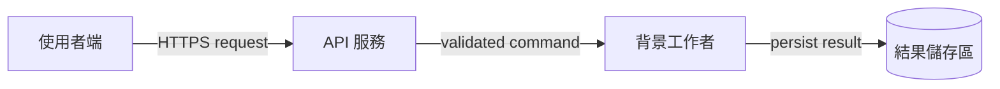
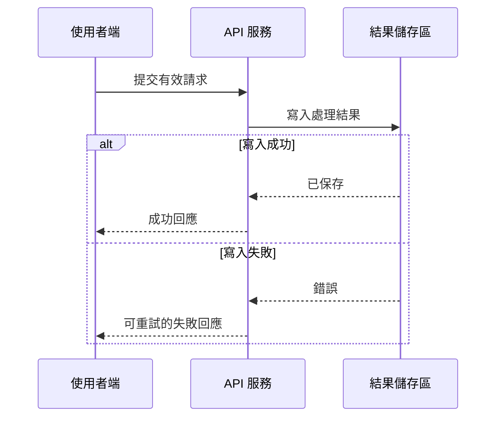

# Mermaid 架構圖與時序圖

圖表是用來降低讀者理解成本，不是裝飾。只描繪能由原始碼、部署設定、介面契約、監控或已核准 ADR 證實的關係；缺少證據時在圖外標為假設或待確認。

## 選擇圖表

| 讀者問題 | 使用圖表 | 重點 |
|---|---|---|
| 系統有哪些邊界、元件與資料流？ | `flowchart` 架構圖 | 元件責任、外部依賴、同步或非同步資料流。 |
| 一次請求、事件或故障如何依序流動？ | `sequenceDiagram` 時序圖 | 發起者、訊息順序、回應、錯誤與重試。 |
| 狀態如何轉換？ | `stateDiagram-v2` | 合法狀態、轉換事件與終止狀態。 |

若單一圖同時試圖回答元件邊界與每個請求步驟，拆成架構圖與時序圖。README 不應因圖表而變成完整技術設計；較複雜圖放在 technical-writing 文件。

## 架構圖

以讀者可辨識的責任命名節點，而非套件或檔名。以 subgraph 表達信任、部署或網路邊界；箭頭文字標示資料或協議，必要時標示同步或非同步。不要畫出未驗證的資料庫、快取、queue 或服務。

圖後以短文說明：各元件責任、資料保存位置、主要失敗邊界與不在範圍的元件。若資料流具有優先序、重試或冪等性，文字明示，不靠箭頭暗示。

## 時序圖

參與者只保留理解情境所需者。箭頭文字使用可觀察動作或訊息，不使用「處理資料」等模糊詞。使用 `alt`、`opt`、`loop` 表達條件、可選流程與重試；錯誤路徑要說明回應、補償或操作者行動。

## 審查清單

- 圖能回答文件開頭宣告的問題，且不重複段落文字。
- 節點、訊息、協議、邊界與錯誤路徑有來源或待確認標記。
- 命名與本文、程式碼、設定一致，縮寫首次出現有定義。
- 圖在 GitHub Markdown 渲染可讀，節點與箭頭不過度擁擠。
- 系統變更時，將圖表納入文件更新與驗證範圍。
