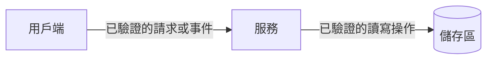
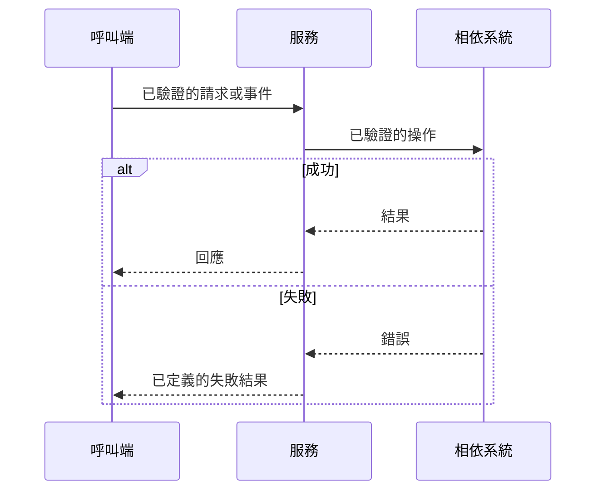
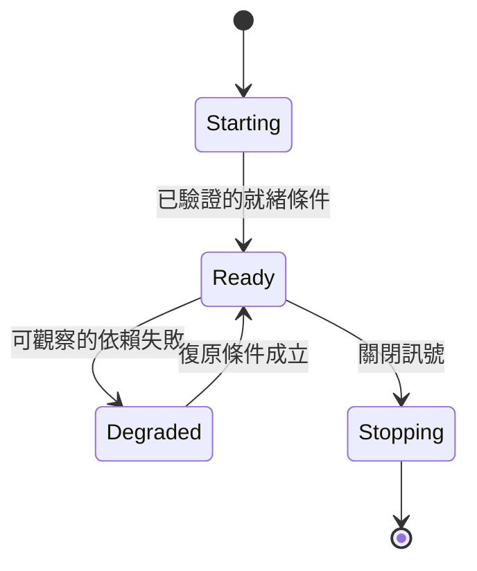

# [系統或元件名稱] 架構

> 文件狀態：[草稿／已核准]  
> 最後驗證：[日期與證據來源]

## 目的、讀者與決策問題

說明此文件要協助哪類讀者做出什麼決策或安全操作；列出範圍、非目標與不涵蓋的系統。

## 信任邊界與敏感資料

| 邊界或資料 | 來源與去向 | 驗證、授權或保護方式 | 證據 |
|---|---|---|---|
| [待確認] | [待確認] | [待確認] | [檔案、設定或 ADR] |

## 系統邊界與元件責任

| 元件 | 責任 | 介面或依賴 | 證據 |
|---|---|---|---|
| [待確認] | [待確認] | [待確認] | [檔案、設定或 ADR] |

## 主要資料流

說明資料、同步或非同步邊界、持久化位置與主要失敗模式。圖中每個節點與箭頭都要有證據。

## 關鍵互動時序

只在請求、事件、重試或錯誤順序會影響讀者判斷時填寫。

## 狀態與生命週期

僅在元件有可觀察的啟動、就緒、降級、重試或關閉狀態時填寫。

## 介面與資料契約

| 介面 | 呼叫端與提供端 | 協議／認證 | 輸入與輸出 | Timeout／重試 | 證據 |
|---|---|---|---|---|---|
| [待確認] | [待確認] | [待確認] | [待確認] | [待確認] | [待確認] |

## 失敗模式、復原與一致性

| 失敗模式 | 偵測訊號 | 隔離或重試 | 一致性／資料影響 | 復原或升級 |
|---|---|---|---|---|
| [待確認] | [待確認] | [待確認] | [待確認] | [待確認] |

## 部署、可用性與觀測

- 部署邊界、replica、依賴與 failover：[待確認]
- 健康檢查、readiness、SLO、告警與 dashboard：[待確認]
- 圖表與本節最後驗證日期、來源檔案：[待確認]

## 關鍵取捨與限制

- [已驗證的取捨、原因與後果]
- [已驗證的限制或 non-goal]

## ADR 與相關文件

- 相關 ADR、操作手冊與程式碼入口：[待確認]
