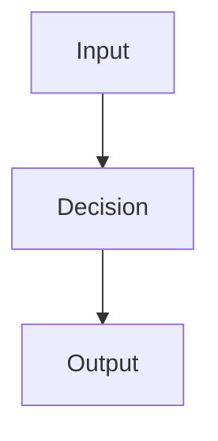

# 設計文件：{Feature Name}

## 設計摘要

{用 2 到 5 句說明方案、關鍵取捨與不做的事情。}

## 文件定位

{說明本設計與 requirements.md、舊 spec、既有文件或既有實作的關係。明確標出本文件不重寫哪些模組。}

## 已知契約狀態

- 需求來源: {requirements.md 章節、issue、舊 spec 或待確認}
- API / CLI / Hook contract: {OpenAPI、help output、設定檔 schema 或待確認}
- Data contract: {資料表、DTO、設定格式或待確認}
- 既有實作: {已存在的 route、service、component、script 或待確認}
- 不可假造: {不得自行假造的 API、欄位、狀態、權限或資料}

## Bounded Context

包含：

- {本 spec 負責的功能、流程、模組或使用者情境}

不包含：

- {本 spec 不處理且不應重寫的既有模組或外部流程}

## 設計原則

- {原則一，例如保持既有 API 相容}
- {原則二，例如只改 task Boundary 內檔案}

## 需求對應

| 需求 / 驗收情境 | 設計處理方式 | 驗證方式 |
|-----------------|--------------|----------|
| {需求或情境名稱} | {設計如何滿足} | `{測試或命令}` |

## 受影響檔案計畫

| 檔案 | 預期變更 | 原因 | 風險 |
|------|----------|------|------|
| `{path}` | {變更摘要} | {原因} | {風險或無} |

## 目標結構或流程

{描述主要結構、流程、資料流或控制流。若有前後端、CLI、hook、安裝流程，分段描述。}

## Mermaid Diagrams

{需要時加入 architecture diagrams、flow charts 或 sequence diagrams；不需要時寫「不需要」。}

## 介面與資料契約

### API / CLI / Hook

- Input: {輸入、參數或事件}
- Output: {輸出、回傳、檔案或副作用}
- Error: {錯誤情境與訊息}

### Data / Config

- 新增資料: {新增資料結構或設定；沒有則填無}
- 既有資料相容性: {是否需要 migration 或相容處理}

## 關鍵行為

- {重要行為一}
- {重要行為二}

## 前後端或跨模組設計

{同一功能涉及多層時填寫；不涉及可填無。不要因 frontend/backend 技術層自動拆 spec。}

## Protected Behavior

- {不可破壞的既有行為}
- {需要回歸驗證的流程}

## 替代方案

| 方案 | 優點 | 缺點 | 結論 |
|------|------|------|------|
| {方案 A} | {優點} | {缺點} | {採用或不採用原因} |

## 風險與處理方式

| 風險 | 影響 | 處理方式 | 驗證 |
|------|------|----------|------|
| {風險} | {影響} | {處理} | `{測試或檢查}` |

## 實作注意事項

- {會影響 task 拆分、Boundary 或驗證順序的注意事項}
- {若設計偏離需求，需同步更新 requirements.md}
