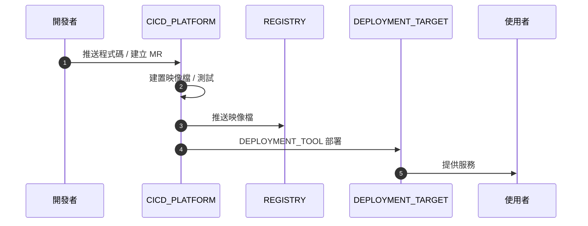
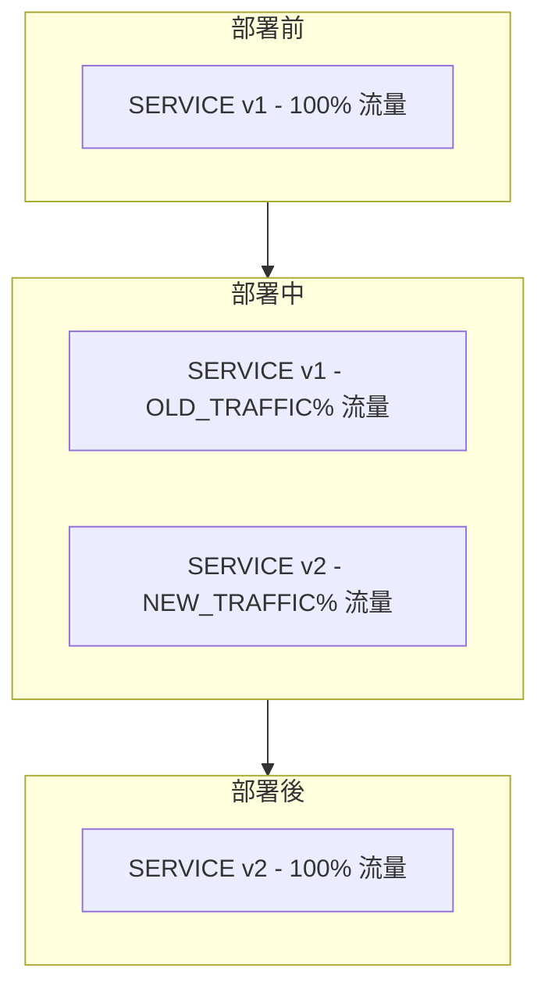
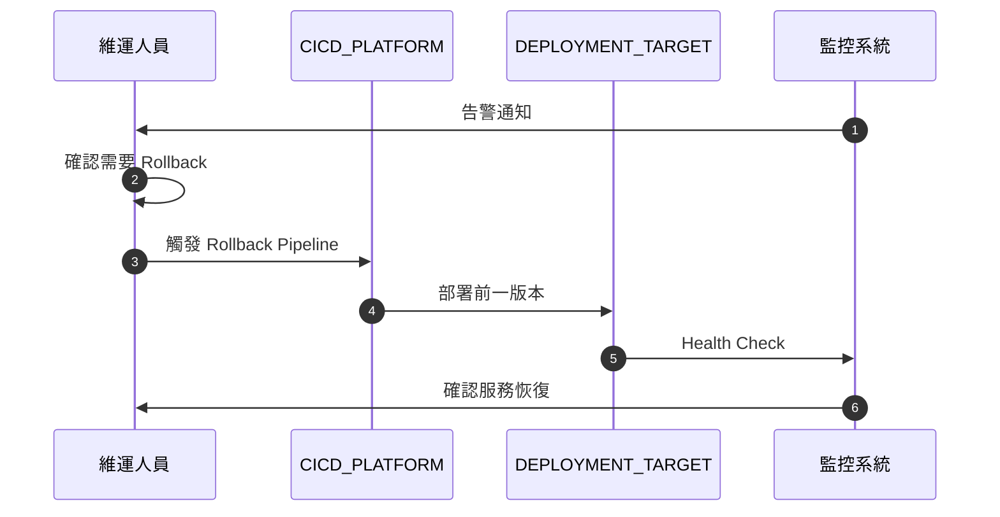

# CI/CD Pipeline: ${PROJECT_NAME}

**負責團隊:** ${TEAM_NAME}
**最後更新:** ${DATE}
**CI/CD 平台:** ${CICD_PLATFORM}

---

## 總覽

| 項目 | 內容 |
|------|------|
| 原始碼管理 | ${SCM_PLATFORM} |
| CI/CD 平台 | ${CICD_PLATFORM} |
| Container Registry | ${REGISTRY} |
| 部署目標 | ${DEPLOYMENT_TARGET} |
| 部署工具 | ${DEPLOYMENT_TOOL} |
| 分支策略 | ${BRANCHING_STRATEGY} |

---

## Deployment 流程圖



---

## Pipeline 階段

```mermaid
graph LR
    A[Commit] --> B[Lint / Static Analysis]
    B --> C[Unit Test]
    C --> D[Build Image]
    D --> E[Push to Registry]
    E --> F[Deploy to ENV_DEV]
    F --> G[Integration Test]
    G --> H[Deploy to ENV_STG]
    H --> I[Smoke Test / QA]
    I --> J[Approval Gate]
    J --> K[Deploy to ENV_PROD]
    K --> L[Health Check]
```



---

## 環境與分支對應

| 分支 | 觸發條件 | 部署環境 | 自動/手動 | 備註 |
|------|----------|----------|-----------|------|
| ${BRANCH_DEV} | Push | ${ENV_DEV} | 自動 | ${NOTES} |
| ${BRANCH_STG} | MR Merge | ${ENV_STG} | 自動 | ${NOTES} |
| ${BRANCH_PROD} | Tag / Release | ${ENV_PROD} | 手動審核 | ${NOTES} |

---

## Pipeline 各階段定義

### 1. Lint / Static Analysis

| 項目 | 內容 |
|------|------|
| 工具 | ${LINT_TOOLS} |
| 觸發條件 | 每次 Commit |
| 失敗處理 | 阻擋 Pipeline |
| 超時設定 | ${TIMEOUT} |

### 2. Unit Test

| 項目 | 內容 |
|------|------|
| 框架 | ${TEST_FRAMEWORK} |
| 覆蓋率要求 | >= ${COVERAGE_THRESHOLD}% |
| 觸發條件 | 每次 Commit |
| 失敗處理 | 阻擋 Pipeline |
| 超時設定 | ${TIMEOUT} |

### 3. Build Image

| 項目 | 內容 |
|------|------|
| Dockerfile 位置 | ${DOCKERFILE_PATH} |
| Base Image | ${BASE_IMAGE} |
| Image Tag 策略 | ${TAG_STRATEGY} |
| 多階段建置 | ${MULTI_STAGE_BUILD} |

### 4. Push to Registry

| 項目 | 內容 |
|------|------|
| Registry | ${REGISTRY} |
| Image 命名規則 | ${IMAGE_NAMING_CONVENTION} |
| 保留政策 | ${RETENTION_POLICY} |

### 5. Deploy

| 項目 | 內容 |
|------|------|
| 部署工具 | ${DEPLOYMENT_TOOL} |
| 部署策略 | ${DEPLOYMENT_STRATEGY} |
| Manifest 位置 | ${MANIFEST_PATH} |
| Rollback 方式 | ${ROLLBACK_METHOD} |

### 6. Health Check

| 項目 | 內容 |
|------|------|
| 檢查端點 | ${HEALTH_ENDPOINT} |
| 檢查方式 | ${CHECK_METHOD} |
| 等待時間 | ${WAIT_TIME} |
| 失敗處理 | ${FAILURE_ACTION} |

---

## 部署策略

### ${DEPLOYMENT_STRATEGY} 部署



| 項目 | 設定 |
|------|------|
| 策略 | ${DEPLOYMENT_STRATEGY} |
| 最小可用比例 | ${MIN_AVAILABLE} |
| 最大超額比例 | ${MAX_SURGE} |
| Canary 比例 | ${CANARY_PERCENTAGE} |
| 觀察時間 | ${OBSERVATION_PERIOD} |
| 自動 Rollback 條件 | ${AUTO_ROLLBACK_CONDITION} |

---

## Rollback 流程



### Rollback 步驟

1. 確認問題與影響範圍
2. 決定 Rollback 目標版本
3. 執行 Rollback

```bash
${ROLLBACK_COMMAND}
```

4. 驗證服務恢復

```bash
${HEALTH_CHECK_COMMAND}
```

5. 通知相關人員

---

## 環境變數與 Secrets

### 環境變數

| 變數名稱 | 用途 | 來源 | 環境 |
|----------|------|------|------|
| ${ENV_VAR_NAME} | ${PURPOSE} | ${SOURCE} | ${ENVIRONMENTS} |

### Secrets 管理

| Secret 名稱 | 用途 | 儲存位置 | 輪換週期 |
|-------------|------|----------|----------|
| ${SECRET_NAME} | ${PURPOSE} | ${STORE} | ${ROTATION} |

---

## Artifact 管理

| 類型 | 儲存位置 | 保留政策 | 備註 |
|------|----------|----------|------|
| Container Image | ${REGISTRY} | ${RETENTION} | ${NOTES} |
| Build Log | ${LOCATION} | ${RETENTION} | ${NOTES} |
| Test Report | ${LOCATION} | ${RETENTION} | ${NOTES} |

---

## 通知設定

| 事件 | 通知管道 | 接收者 | 備註 |
|------|----------|--------|------|
| Pipeline 失敗 | ${CHANNEL} | ${RECIPIENTS} | ${NOTES} |
| 部署成功 | ${CHANNEL} | ${RECIPIENTS} | ${NOTES} |
| Rollback 觸發 | ${CHANNEL} | ${RECIPIENTS} | ${NOTES} |

---

## 品質檢查清單

- [ ] Pipeline 各階段已定義且可執行
- [ ] 分支與環境對應關係已確認
- [ ] Prod 部署需手動審核
- [ ] Rollback 流程已測試
- [ ] Secrets 未寫死在程式碼或 Pipeline 設定中
- [ ] Container Image Tag 策略明確（非 latest）
- [ ] Health Check 已設定
- [ ] 通知管道已配置
- [ ] Image 保留政策已設定
- [ ] Pipeline 超時設定合理
