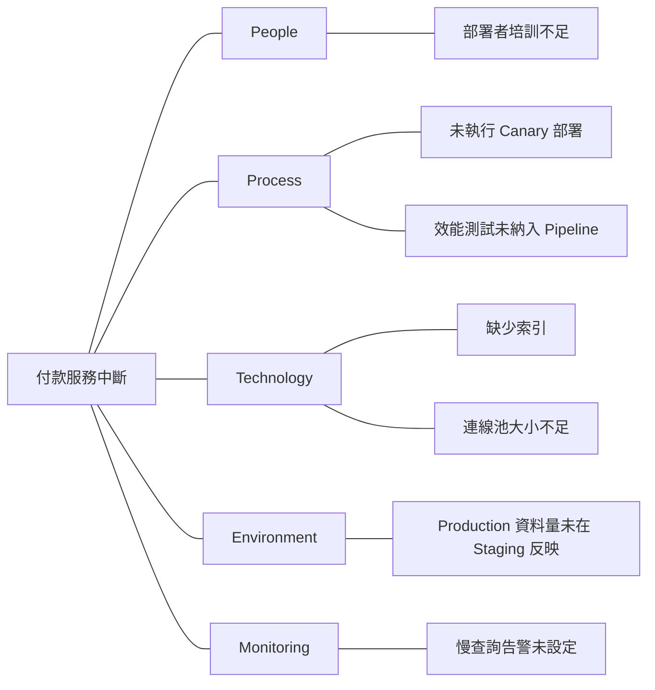

# RCA Methodology — 根因分析方法論指南

系統性追溯事故根本原因的結構化分析技術集合。

## 此技能的功能

- 提供 5 Whys、Fishbone、Fault Tree 等 RCA 方法論
- 指導如何避免常見分析陷阱（單一原因、歸咎個人、確認偏誤）
- 提供認知偏誤防範清單
- 強化根因分析的證據等級評估

## 適用時機

- 執行根因分析時需要方法論指引
- 分析複雜的複合原因事故
- 需要向團隊說明 RCA 方法
- 搭配 `sre-incident-postmortem` 技能使用

## 觸發範例

以下輸入會啟動此技能：
- 「用 5 Whys 分析這個事故的根因」
- 「幫我畫 Fishbone 圖分析這次中斷」
- 「做一個 Fault Tree Analysis」
- 「我需要 RCA 方法論指引」

---

## 1. 5 Whys 技術

### 執行步驟

從表面症狀開始，重複問「為什麼」至少 5 次：

```
問題：付款服務中斷 30 分鐘

Why 1：為什麼付款服務中斷？
→ DB 連線池耗盡

Why 2：為什麼連線池耗盡？
→ 慢查詢長時間佔用連線

Why 3：為什麼出現慢查詢？
→ 缺少索引導致全表掃描

Why 4：為什麼沒有索引？
→ 新功能部署的 Migration 遺漏了索引新增

Why 5：為什麼遺漏未被偵測？
→ 部署 Pipeline 未包含查詢效能驗證步驟

根因：部署 Pipeline 缺少查詢效能驗證步驟
```

### 5 Whys 常見陷阱

| 陷阱 | 說明 | 防範方式 |
|------|------|---------|
| 過早停止 | 在第 2-3 步就下結論 | 驗證：「修正這個能防止再次發生嗎？」 |
| 導向歸咎 | 以「誰犯了錯」作結 | 聚焦系統/流程原因 |
| 單一路徑 | 忽略複合原因 | 每個步驟都檢視是否有分支 |
| 基於推測 | 假設未經證據驗證 | 以 Log/Metric 驗證每個答案 |

---

## 2. Fishbone 圖（石川圖）

### 軟體系統的 6M 分類

| 傳統 6M | 軟體應用 | 調查項目 |
|---------|---------|---------|
| Man（人） | People/Team | 培訓、溝通、On-call 結構 |
| Method（方法） | Process | 部署程序、變更管理、審核流程 |
| Machine（機器） | Technology/Infrastructure | 伺服器、DB、網路、程式碼 |
| Material（材料） | Data/Input | 輸入資料、外部 API 回應 |
| Measurement（量測） | Monitoring | 告警、Metric、Log、Tracing |
| Environment（環境） | Environment | 設定、環境變數、相依服務 |

### Fishbone 圖範例（Mermaid）



---

## 3. Fault Tree Analysis（FTA）

### 樹狀結構範例

```
付款服務中斷（Top Event）
│
├─── OR ───┤
│          │
DB 故障    應用程式故障
│          │
OR         AND
│          │        │
連線池耗盡  慢查詢   高流量
│
AND
│          │
缺少索引   大量資料
```

### 機率計算

```
OR gate：P(A OR B) = 1 - (1-P(A)) × (1-P(B))
AND gate：P(A AND B) = P(A) × P(B)

範例：P(慢查詢)=0.3，P(高流量)=0.2
P(應用程式故障) = 0.3 × 0.2 = 0.06（6%）
```

### FTA 輸出格式

| 層級 | 事件/條件 | 閘道類型 | 機率 | 證據等級 |
|------|---------|---------|------|---------|
| 0（TOP） | 服務中斷 | AND | — | Confirmed |
| 1 | 有缺陷的程式碼部署 | Basic | — | Confirmed |
| 1 | 自動偵測失敗 | Basic | — | Confirmed |
| 2 | 缺少索引 | Basic | — | Confirmed |
| 2 | 大量資料 | Basic | — | Estimated |

---

## 4. 變更分析（Change Analysis）

事故前後的變更往往是觸發原因。系統性檢查：

### 變更清單

| 變更類型 | 檢查項目 | 時間窗口 |
|---------|---------|---------|
| 程式碼部署 | 哪個版本？哪個服務？ | 事故前 24h |
| 設定變更 | 環境變數、Feature Flag | 事故前 24h |
| 基礎設施 | 擴縮容、網路變更 | 事故前 48h |
| 外部依賴 | 第三方 API、資料庫版本 | 事故前 72h |
| 流量模式 | 異常流量、促銷活動 | 事故前 1 週 |

---

## 5. 認知偏誤防範清單

| 偏誤 | 說明 | 防範方式 |
|------|------|---------|
| 後見之明偏誤 | 「這很明顯應該被發現」 | 從當時的資訊角度重新評估 |
| 確認偏誤 | 只尋找支持既有假設的證據 | 主動尋找反駁證據 |
| 歸因謬誤 | 將系統問題歸咎於個人 | 問「系統為何允許這件事發生」 |
| 近因偏誤 | 過度關注最近的變更 | 系統性檢查所有可能原因 |
| 單一原因謬誤 | 找到一個原因就停止分析 | 繼續問「還有其他原因嗎？」 |

---

## 6. 證據等級標準

| 等級 | 說明 | 範例 |
|------|------|------|
| **Confirmed** | 有直接證據支持 | Log 明確顯示錯誤訊息 |
| **Estimated** | 有間接證據，合理推斷 | Metric 趨勢與假設一致 |
| **Unconfirmed** | 假設，尚無證據 | 推測可能是環境因素 |

---

## 7. 根因分析輸出格式

```markdown
# 根因分析

## 分析摘要
- **直接原因**：直接觸發事故的原因
- **根本原因**：允許直接原因發生的系統性原因
- **貢獻因素**：加劇事故的額外因素

## 5 Whys 分析
1. **Why** 服務中斷？→ [答案]
2. **Why** [答案1] 發生？→ [答案]
3. **Why** [答案2] 發生？→ [答案]
4. **Why** [答案3] 發生？→ [答案]
5. **Why** [答案4] 發生？→ [根本原因]

## Fishbone 圖
[Mermaid 圖]

## Fault Tree
[表格]

## 貢獻因素
| 因素 | 影響 | 類別 | 證據等級 |

## 證據清單
| 證據 | 來源 | 支持假設 | 反駁假設 |
```
