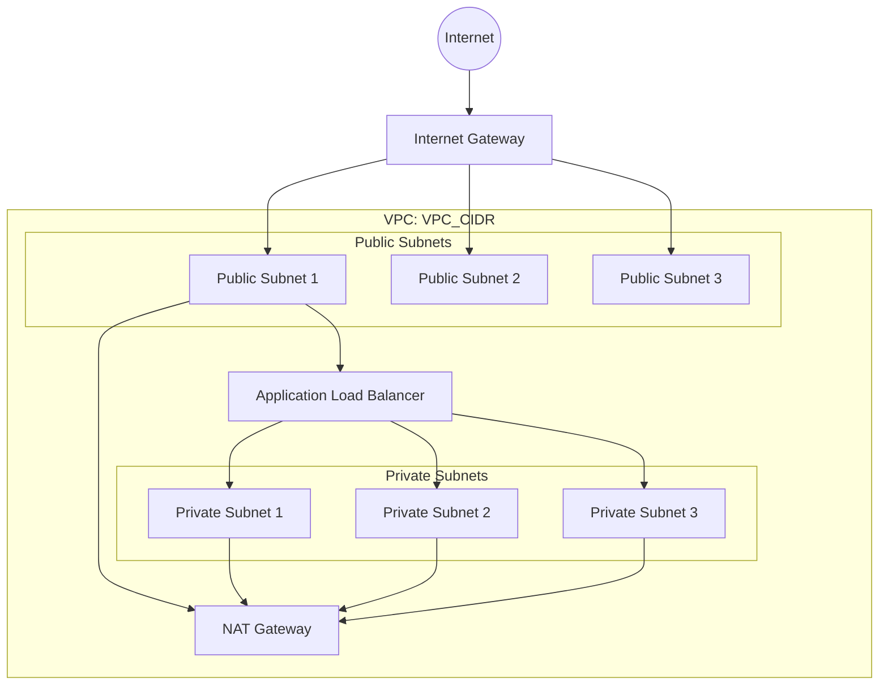
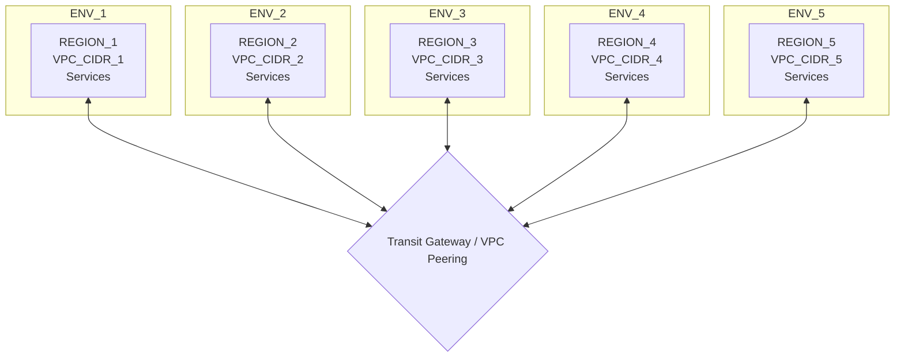

# ${PROJECT_NAME} AWS VPC 架構

## 總覽

| 環境 | AWS Account | Region | VPC CIDR | 用途 |
|------|-------------|--------|----------|------|
| ${ENV_NAME_1} | ${ACCOUNT_ID_1} | ${REGION_1} | ${VPC_CIDR_1} | ${PURPOSE_1} |
| ${ENV_NAME_2} | ${ACCOUNT_ID_2} | ${REGION_2} | ${VPC_CIDR_2} | ${PURPOSE_2} |
| ${ENV_NAME_3} | ${ACCOUNT_ID_3} | ${REGION_3} | ${VPC_CIDR_3} | ${PURPOSE_3} |
| ${ENV_NAME_4} | ${ACCOUNT_ID_4} | ${REGION_4} | ${VPC_CIDR_4} | ${PURPOSE_4} |
| ${ENV_NAME_5} | ${ACCOUNT_ID_5} | ${REGION_5} | ${VPC_CIDR_5} | ${PURPOSE_5} |

---

## ${ENV_NAME_1} - ${REGION_1}

**AWS Account:** ${ACCOUNT_ID_1}
**VPC CIDR:** ${VPC_CIDR_1}

### Subnet

| # | IPv4 CIDR | 名稱 | 類型 | AZ |
|---|-----------|------|------|-----|
| 1 | ${PUBLIC_SUBNET_CIDR_1} | ${PUBLIC_SUBNET_NAME_1} | Public | ${AZ_1} |
| 2 | ${PUBLIC_SUBNET_CIDR_2} | ${PUBLIC_SUBNET_NAME_2} | Public | ${AZ_2} |
| 3 | ${PRIVATE_SUBNET_CIDR_1} | ${PRIVATE_SUBNET_NAME_1} | Private | ${AZ_1} |
| 4 | ${PRIVATE_SUBNET_CIDR_2} | ${PRIVATE_SUBNET_NAME_2} | Private | ${AZ_2} |

> 依環境需求增減 Subnet 數量，建議至少跨 2 個 AZ。
> Prod 環境建議 3 AZ 配置。

---

## ${ENV_NAME_2} - ${REGION_2}

**AWS Account:** ${ACCOUNT_ID_2}
**VPC CIDR:** ${VPC_CIDR_2}

### Subnet

| # | IPv4 CIDR | 名稱 | 類型 | AZ |
|---|-----------|------|------|-----|
| 1 | ${PUBLIC_SUBNET_CIDR_1} | ${PUBLIC_SUBNET_NAME_1} | Public | ${AZ_1} |
| 2 | ${PUBLIC_SUBNET_CIDR_2} | ${PUBLIC_SUBNET_NAME_2} | Public | ${AZ_2} |
| 3 | ${PUBLIC_SUBNET_CIDR_3} | ${PUBLIC_SUBNET_NAME_3} | Public | ${AZ_3} |
| 4 | ${PRIVATE_SUBNET_CIDR_1} | ${PRIVATE_SUBNET_NAME_1} | Private | ${AZ_1} |
| 5 | ${PRIVATE_SUBNET_CIDR_2} | ${PRIVATE_SUBNET_NAME_2} | Private | ${AZ_2} |
| 6 | ${PRIVATE_SUBNET_CIDR_3} | ${PRIVATE_SUBNET_NAME_3} | Private | ${AZ_3} |

---

## IP 規劃摘要

```
${VPC_CIDR_1}  ${ENV_NAME_1}  (${REGION_1})  VPC 可用: ${VPC_HOSTS_1} IP  /${SUBNET_MASK_1} subnets - ${HOSTS_PER_SUBNET_1} hosts each
${VPC_CIDR_2}  ${ENV_NAME_2}  (${REGION_2})  VPC 可用: ${VPC_HOSTS_2} IP  /${SUBNET_MASK_2} subnets - ${HOSTS_PER_SUBNET_2} hosts each
${VPC_CIDR_3}  ${ENV_NAME_3}  (${REGION_3})  VPC 可用: ${VPC_HOSTS_3} IP  /${SUBNET_MASK_3} subnets - ${HOSTS_PER_SUBNET_3} hosts each
${VPC_CIDR_4}  ${ENV_NAME_4}  (${REGION_4})  VPC 可用: ${VPC_HOSTS_4} IP  /${SUBNET_MASK_4} subnets - ${HOSTS_PER_SUBNET_4} hosts each
${VPC_CIDR_5}  ${ENV_NAME_5}  (${REGION_5})  VPC 可用: ${VPC_HOSTS_5} IP  /${SUBNET_MASK_5} subnets - ${HOSTS_PER_SUBNET_5} hosts each
```

> 注意：AWS 每個 Subnet 保留 5 個 IP（網路位址、Router、DNS、未來使用、廣播位址），實際可用 IP = 總 IP - 5。

### Subnet 大小規劃邏輯

| 環境 | Subnet Mask | 每 Subnet 可用 IP | 設計考量 |
|------|-------------|-------------------|----------|
| ${ENV_NAME_1} | /${SUBNET_MASK_1} | ${HOSTS_PER_SUBNET_1} | ${SIZING_RATIONALE_1} |
| ${ENV_NAME_2} | /${SUBNET_MASK_2} | ${HOSTS_PER_SUBNET_2} | ${SIZING_RATIONALE_2} |
| ${ENV_NAME_3} | /${SUBNET_MASK_3} | ${HOSTS_PER_SUBNET_3} | ${SIZING_RATIONALE_3} |
| ${ENV_NAME_4} | /${SUBNET_MASK_4} | ${HOSTS_PER_SUBNET_4} | ${SIZING_RATIONALE_4} |
| ${ENV_NAME_5} | /${SUBNET_MASK_5} | ${HOSTS_PER_SUBNET_5} | ${SIZING_RATIONALE_5} |

### 常見 Subnet Mask 參考

| Mask | 可用 IP（AWS 扣除 5 個保留） | 適用場景 |
|------|-------------------------------|----------|
| /24 | 251 | 小型環境、管理用途 |
| /23 | 507 | 中型環境、測試環境 |
| /22 | 1019 | 大型環境、正式環境 |
| /21 | 2043 | 超大型環境、高密度容器 |

---

## 網路拓撲

### 單一 VPC 內部架構

> Mermaid 圖表中以大寫文字表示變數佔位符，實際使用時請替換為對應值。



### 跨環境 VPC 互連



---

## 跨環境連線

### VPC Peering / Transit Gateway

| 來源 | 目的 | 連線方式 | 用途 | 狀態 |
|------|------|----------|------|------|
| ${ENV_NAME_1} | ${ENV_NAME_2} | ${CONNECTION_TYPE} | ${PURPOSE} | ${STATUS} |
| ${ENV_NAME_1} | ${ENV_NAME_5} | ${CONNECTION_TYPE} | ${PURPOSE} | ${STATUS} |

### Route Table 重點

| 環境 | 目的 CIDR | Target | 備註 |
|------|-----------|--------|------|
| ${ENV_NAME_1} | ${VPC_CIDR_2} | ${TARGET_ID} | ${NOTES} |

---

## 安全設計

### Security Group 規劃

| SG 名稱 | 用途 | Inbound 規則摘要 | 備註 |
|---------|------|------------------|------|
| ${SG_NAME_1} | ${PURPOSE} | ${INBOUND_RULES} | ${NOTES} |
| ${SG_NAME_2} | ${PURPOSE} | ${INBOUND_RULES} | ${NOTES} |

### NACL 規劃

| Subnet 類型 | 允許 Inbound | 允許 Outbound | 備註 |
|-------------|-------------|--------------|------|
| Public | ${INBOUND_RULES} | ${OUTBOUND_RULES} | ${NOTES} |
| Private | ${INBOUND_RULES} | ${OUTBOUND_RULES} | ${NOTES} |

---

## NAT Gateway

| 環境 | NAT GW 數量 | 部署位置 | 高可用 |
|------|------------|----------|--------|
| ${ENV_NAME} | ${COUNT} | ${AZ_PLACEMENT} | ${HIGH_AVAILABILITY} |

---

## 品質檢查清單

- [ ] 各環境 VPC CIDR 無重疊
- [ ] Public / Private Subnet 分離明確
- [ ] 每個環境至少跨 2 個 AZ
- [ ] Prod 環境 Subnet 預留足夠擴展空間
- [ ] VPC Peering / Transit Gateway 路由已設定
- [ ] Security Group 與 NACL 規則已審查
- [ ] NAT Gateway 高可用配置已確認
- [ ] VPC Flow Logs 已啟用
- [ ] DNS Resolution 與 DNS Hostnames 已啟用
- [ ] 未來擴展的 CIDR 空間已預留
